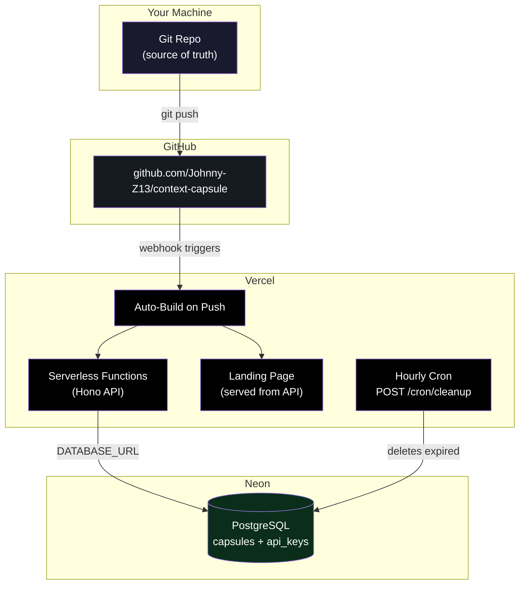

# Context Capsule

**Portable execution context for agent workflows.**

Package the facts, current state, and next-step intent an agent needs to continue reliably — structured, compressed, ephemeral context that travels between agents, sessions, and tools.

> Agents should not restart from scratch when they can resume from a capsule.

[Live Site](https://www.contextcapsule.ai) | [API Docs](https://www.contextcapsule.ai/docs) | [MCP Server](https://www.npmjs.com/package/@contextcapsule/mcp-server) | [llms.txt](https://www.contextcapsule.ai/llms.txt)

## The Problem

Agentic workflows lose context at every handoff: between agents, between sessions, between tools. Teams currently solve this with raw prompts, copy-pasted summaries, oversized system messages, and manual context reconstruction.

Context Capsule replaces all of that with a single primitive: a short-lived, machine-readable **execution context packet** that carries what the next agent actually needs:

- What happened before? (memory)
- What's true right now? (state)
- What should happen next? (intent)
- Where did this come from? (refs)

## How It Works

```
1. Agent completes work → creates a capsule (POST /v1/capsules)
2. Next agent (or same agent later) → fetches the capsule to resume
3. Capsule expires after 7 days → no cleanup burden
```

Every capsule includes structured decisions, next steps, and optional payload so the receiving agent can pick up exactly where the last one left off.

## Capsule Structure

| Field | Purpose |
|-------|---------|
| `summary` | What happened — human-readable, max 500 chars |
| `decisions` | Key decisions made (array of strings, max 20) |
| `next_steps` | What to do next (array of strings, max 20) |
| `payload` | Structured data, max 32KB |
| `refs` | Workflow references (workflow_id, agent_id, session_id, etc.) |

## Quick Start

### 1. Get an API Key

```bash
curl -X POST https://www.contextcapsule.ai/v1/auth/signup \
  -H "Content-Type: application/json" \
  -d '{"email": "you@example.com"}'
```

Save the returned key immediately — it cannot be retrieved later.

### 2. Create a Capsule

```bash
curl -X POST https://www.contextcapsule.ai/v1/capsules \
  -H "Authorization: Bearer ck_your_key_here" \
  -H "Content-Type: application/json" \
  -d '{
    "summary": "Completed data migration for user table, added new columns",
    "decisions": [
      "Used addColumn instead of recreating table",
      "Kept backward compat with old schema"
    ],
    "next_steps": [
      "Run integration tests against new schema",
      "Update API serializers for new fields"
    ],
    "refs": {
      "workflow_id": "migration-456",
      "agent_id": "schema-agent"
    }
  }'
```

Returns:

```json
{
  "capsule_id": "cap_abc123...",
  "summary": "Completed data migration for user table, added new columns",
  "decisions": ["Used addColumn instead of recreating table", "Kept backward compat with old schema"],
  "next_steps": ["Run integration tests against new schema", "Update API serializers for new fields"],
  "capsule_url": "https://www.contextcapsule.ai/capsule/cap_abc123...",
  "created_at": "2026-04-03T12:00:00.000Z",
  "expires_at": "2026-04-10T12:00:00.000Z"
}
```

### 3. Fetch a Capsule

```bash
# JSON (for agents)
curl https://www.contextcapsule.ai/v1/capsules/cap_abc123?format=json

# HTML (for humans — paste the capsule_url in a browser)
```

## API Reference

| Method | Endpoint | Auth | Description |
|--------|----------|------|-------------|
| `POST` | `/v1/capsules` | API Key | Create a capsule |
| `GET` | `/v1/capsules/:id` | None | Fetch a capsule (JSON or HTML) |
| `GET` | `/capsule/:id` | None | Shortcut fetch (same behavior) |
| `POST` | `/v1/auth/signup` | None | Get an API key |
| `GET` | `/health` | None | Health check |

### Create Capsule Fields

| Field | Required | Description |
|-------|----------|-------------|
| `summary` | Yes | Human-readable description, max 500 chars |
| `decisions` | No | Key decisions made (string array, max 20 items, 500 chars each) |
| `next_steps` | No | What to do next (string array, max 20 items, 500 chars each) |
| `payload` | No | Structured JSON data, max 32KB |
| `refs` | No | Workflow references: `workflow_id`, `agent_id`, `session_id`, etc. |
| `expires_in` | No | TTL in seconds (60–604800). Default: 604800 (7 days) |
| `idempotency_key` | No | Prevents duplicate capsules on retry |
| `audience` | No | Set to `"human"` to enrich the view page with social card meta tags |

### Rate Limits

| Endpoint | Limit | Scope |
|----------|-------|-------|
| `POST /v1/capsules` | 60/min | Per API key |
| `GET /v1/capsules/:id` | 120/min | Per IP |
| `POST /v1/auth/signup` | 5/min | Per IP |

Rate limit headers (`X-RateLimit-Limit`, `X-RateLimit-Remaining`, `X-RateLimit-Reset`) are included on every response.

### Idempotency

Include an `idempotency_key` to safely retry capsule creation. If a capsule with the same key already exists and the content matches, the original capsule is returned. If the content differs, you'll get a `409 idempotency_conflict` error.

## MCP Server

Use Context Capsule as a tool in Claude Desktop, Cursor, Windsurf, or any MCP-compatible client:

```bash
npx -y @contextcapsule/mcp-server
```

**Tools available:**

| Tool | Description |
|------|-------------|
| `create_capsule` | Create a context capsule |
| `fetch_capsule` | Fetch a capsule by ID |

**Configuration (Claude Desktop `claude_desktop_config.json`):**

```json
{
  "mcpServers": {
    "contextcapsule": {
      "command": "npx",
      "args": ["-y", "@contextcapsule/mcp-server"],
      "env": {
        "CONTEXTCAPSULE_API_KEY": "ck_your_key_here"
      }
    }
  }
}
```

## Agent Discovery

Context Capsule exposes machine-readable discovery endpoints so agents and tools can self-onboard:

| Endpoint | Format | Purpose |
|----------|--------|---------|
| [`/llms.txt`](https://www.contextcapsule.ai/llms.txt) | Plain text | LLM context summary |
| [`/llms-full.txt`](https://www.contextcapsule.ai/llms-full.txt) | Plain text | Complete API reference for LLMs |
| [`/docs`](https://www.contextcapsule.ai/docs) | HTML | Human-readable API docs |
| [`/.well-known/openapi.json`](https://www.contextcapsule.ai/.well-known/openapi.json) | JSON | OpenAPI 3.1 spec |
| [`/.well-known/mcp.json`](https://www.contextcapsule.ai/.well-known/mcp.json) | JSON | MCP server discovery |
| [`/.well-known/ai-plugin.json`](https://www.contextcapsule.ai/.well-known/ai-plugin.json) | JSON | ChatGPT plugin manifest |
| [`/.well-known/agent.json`](https://www.contextcapsule.ai/.well-known/agent.json) | JSON | Agent protocol discovery |

## Self-Hosting

### Prerequisites

- Node.js 18+
- PostgreSQL (Neon recommended, any Postgres works)

### Setup

```bash
git clone https://github.com/Johnny-Z13/context-capsule.git
cd context-capsule
npm install

# Configure environment
cp .env.example .env
# Edit .env with your DATABASE_URL and BASE_URL

# Run migrations
npm run db:migrate

# Seed an API key
npm run db:seed -- you@example.com

# Start dev server
npm run dev
```

### Environment Variables

| Variable | Required | Description |
|----------|----------|-------------|
| `DATABASE_URL` | Yes | Postgres connection string |
| `BASE_URL` | Yes | Public URL (used in `capsule_url` generation) |
| `CRON_SECRET` | Production | Bearer token for the cleanup cron endpoint |
| `RESEND_API_KEY` | Production | Resend API key for emailing API keys to web signups |
| `DEV_SECRET` | Optional | Secret key to access `/dev/console` test page |
| `NODEJS_HELPERS` | Production | Set to `0` (required for Hono zero-config on Vercel) |

### Scripts

| Command | Description |
|---------|-------------|
| `npm run dev` | Start local dev server (port 3000, hot reload) |
| `npm test` | Run test suite |
| `npm run db:generate` | Generate migrations from schema changes |
| `npm run db:migrate` | Run database migrations |
| `npm run db:seed -- <email>` | Create an API key for the given email |

## Deployment Architecture



## Architecture

```
src/
├── index.ts              # Hono app, middleware chain, routing
├── dev.ts                # Local dev server
├── db/
│   ├── schema.ts         # Drizzle schema (capsules, api_keys)
│   ├── client.ts         # Neon DB connection
│   └── migrate.ts        # Migration runner
├── routes/
│   ├── capsules.ts       # POST /v1/capsules
│   ├── fetch.ts          # GET /capsule/:id, /v1/capsules/:id
│   ├── auth.ts           # POST /v1/auth/signup
│   └── cron.ts           # POST /cron/cleanup
├── middleware/
│   ├── api-key-auth.ts   # Bearer token → hash validation
│   ├── rate-limit.ts     # Per-key and per-IP rate limiting
│   ├── security.ts       # CORS, headers, body limits
│   └── logger.ts         # Structured JSON request logging
├── lib/
│   ├── ids.ts            # nanoid generators (cap_, ck_, req_)
│   ├── hash.ts           # SHA-256 hashing
│   ├── validate.ts       # Input validation
│   ├── rate-limit.ts     # In-memory sliding window tracker
│   └── errors.ts         # Error response builder
└── views/
    ├── font.ts           # Departure Mono as inline base64
    ├── landing-page.ts   # HTML homepage
    ├── docs-page.ts      # Single-page API docs
    ├── capsule-page.ts   # Capsule display (shareable, OG tags when audience=human)
    ├── not-found-page.ts # 404 page
    ├── llms-txt.ts       # /llms.txt content
    ├── llms-full-txt.ts  # /llms-full.txt complete reference
    ├── openapi.ts        # OpenAPI 3.1 spec
    └── mcp-json.ts       # MCP discovery manifest
```

**Stack**: Hono + Drizzle ORM + Neon Postgres + Vercel Serverless (zero-config)

## Better With ProofSlip

Context Capsule tells agents what to do next. [**ProofSlip**](https://proofslip.ai) proves what already happened. Together they're two primitives for reliable agent workflows:

| | Context Capsule | ProofSlip |
|---|---|---|
| **Role** | Navigational | Evidential |
| **Answers** | "What's the situation and what should happen next?" | "What actually happened, and can you verify it?" |
| **Primitive** | Execution context packet | Verifiable receipt |
| **Get started** | [contextcapsule.ai](https://www.contextcapsule.ai) | [proofslip.ai](https://proofslip.ai) |

### Example: Verified Handoff

```bash
# 1. Agent A completes work and creates a ProofSlip receipt as proof
curl -X POST https://proofslip.ai/v1/receipts \
  -H "Authorization: Bearer ak_your_key" \
  -H "Content-Type: application/json" \
  -d '{
    "type": "action",
    "status": "success",
    "summary": "Migrated user table schema"
  }'
# Returns: { "receipt_id": "rct_abc123", ... }

# 2. Agent A creates a capsule referencing that receipt
curl -X POST https://www.contextcapsule.ai/v1/capsules \
  -H "Authorization: Bearer ck_your_key" \
  -H "Content-Type: application/json" \
  -d '{
    "summary": "Schema migration complete, ready for integration tests",
    "decisions": ["Used addColumn to preserve backward compat"],
    "next_steps": ["Run integration tests", "Update API serializers"],
    "refs": {
      "receipt_ids": ["rct_abc123"],
      "workflow_id": "migration-456"
    }
  }'
# Returns: { "capsule_id": "cap_xyz789", ... }

# 3. Agent B picks up the capsule and verifies the receipt before continuing
curl https://www.contextcapsule.ai/v1/capsules/cap_xyz789?format=json
curl https://proofslip.ai/v1/verify/rct_abc123?format=json
# Receipt checks out → proceed with integration tests
```

The capsule carries the navigation. The receipt carries the proof. Neither agent has to trust the other's claims — they verify.

> **Don't have ProofSlip yet?** [Get a free API key](https://proofslip.ai/v1/auth/signup) — same stack, same patterns, takes 30 seconds.

## Design Principles

- **Ephemeral by default.** 7-day TTL. Not a long-term archive.
- **Machine + human readable.** JSON for agents, styled HTML for browsers. Same URL.
- **Cheap to run.** Serverless, auto-expiring data, minimal storage footprint.
- **Structured execution context.** Memory, state, intent — not a blob of text.
- **Idempotent by design.** Safe retries built into the protocol.

## License

[MIT](LICENSE)
